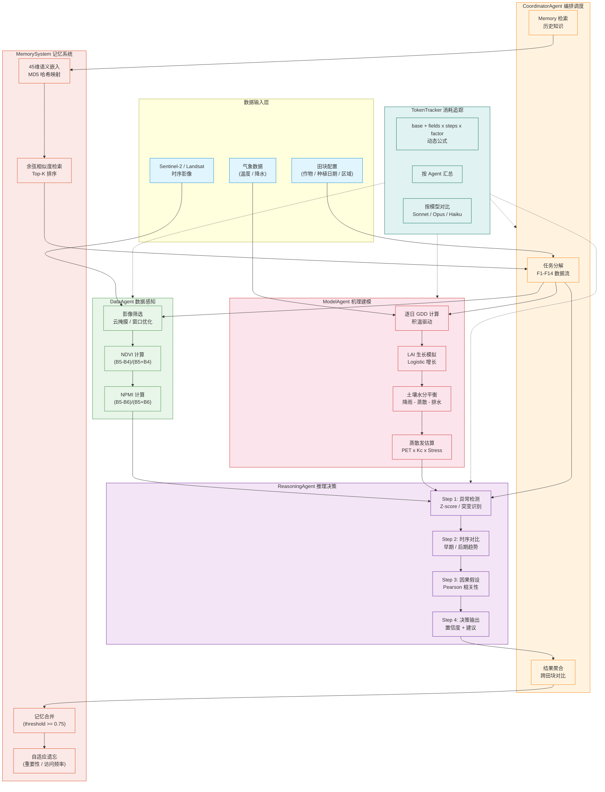

# 系统架构图



---

## 处理流水线（每田块）

```
┌──────────┐    ┌──────────┐    ┌──────────┐    ┌──────────────┐    ┌──────────┐
│ Memory   │ -> │  Data    │ -> │  Model   │ -> │  Reasoning   │ -> │  Memory  │
│ Retrieve │    │  Agent   │    │  Agent   │    │  Agent       │    │  Store   │
└──────────┘    └──────────┘    └──────────┘    └──────────────┘    └──────────┘
     │              │              │                    │                │
     │ 过去知识      │ NDVI/NPMI    │ LAI/SM/ET          │ 异常/趋势/     │ 结果持久化
     │ 跨田块复用    │ 时序         │ 模拟                │ 因果/决策      │
```

---

## 各阶段输入/输出

| 阶段 | 输入 | 输出 | Token 公式 |
|------|------|------|-----------|
| Memory Retrieve | 查询文本（作物+气候+区域） | 相似记忆列表 (score, content) | 80 + 1x1x120 = 200 |
| DataAgent | ImageCollection(30 images) | NDVI、NPMI 时序 (date, value) | 150 + 2x1x120 = 390 |
| ModelAgent | 种植日期、天数、气候 | LAI/SM/ET 逐日记录、汇总统计 | 100 + 3x120x1 = 460 |
| ReasoningAgent | 5 条变量时序 | 异常检测、趋势、因果假设、决策建议 | 180 + 5x4x120 = 2,580 |
| Memory Store | 分析结果 + 决策 | 嵌入 + 存储 + 合并 + 衰减 | 80 + 1x1x120 = 200 |

---

## Token 消耗模式

```
单田块:          ~200 + 390 + 460 + 2,580 + 200 = ~3,830 tokens
55 田块批量实测:  554,835 tokens / 221 次调用 / 3.8s
日预测(200田块):  ~3M - 8M tokens (Sonnet / Opus)
```

---

## 核心设计要点

1. **Token = base + fields x steps x factor** — 不使用常量，每一步可审计
2. **Memory 不是字典** — 45 维语义嵌入 + 余弦相似度 + Top-K 排序检索
3. **推理不是 if-else** — 四步长链：统计异常 → 线性趋势 → Pearson 因果 → 结构化决策
4. **批量可扩展** — 55 田块 3.8s 完成，支持 `consolidate_every` 周期性合并
